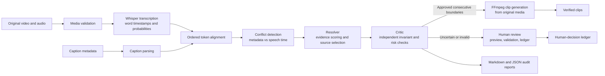

# TimeSync AI

TimeSync AI reconciles caption-metadata timestamps with speech-derived word timestamps, validates the result, and cuts only intervals whose boundaries pass deterministic safety checks.

**Public deployment:** [timesync-ai-production.up.railway.app](https://timesync-ai-production.up.railway.app/)

> TimeSync AI is an assessment project, not a production-ready media service. Local Whisper inference is compute- and memory-intensive, and the hosted demonstration may be subject to platform resource limits.

## The problem

Video workflows often receive caption blocks with approximate start times. Those metadata timestamps can disagree with timestamps inferred from the spoken audio. Blindly trusting metadata can preserve drift or annotation errors; blindly trusting speech recognition can turn a recognition mistake or timing outlier into an incorrect clip boundary.

TimeSync AI treats both timestamps as evidence. It aligns caption starts to real Whisper word boundaries, measures disagreement, selects a source only when deterministic evidence supports it, independently checks that decision, and withholds uncertain boundaries for human review.

## How it works



The end-to-end pipeline validates inputs, transcribes speech, aligns boundaries, resolves conflicts, runs Critic validation, executes eligible cuts, and publishes Markdown/JSON audit reports. Outputs are assembled in a staging directory and published only after the complete run succeeds.

## Components

| Component | Responsibility |
|---|---|
| Caption parser | Parses blank-line-separated caption blocks and converts `MM:SS` or `HH:MM:SS` start timestamps to seconds. |
| Whisper transcriber | Runs local OpenAI Whisper in English with `word_timestamps=True`; records recognized text, word starts/ends, probabilities, language, model, and processing time. The default model is `small.en`. |
| Alignment | Uses a global, order-preserving exact-token alignment. A boundary is emitted only when the first caption token maps to a real Whisper word; it does not invent a word-level metadata timestamp. |
| Conflict detection | Measures absolute metadata/STT disagreement. The default major-conflict threshold is strictly greater than 0.5 seconds. |
| Resolver | Deterministically scores metadata and STT using word probability, text alignment, neighbouring offsets, temporal outliers, and systematic drift. It selects metadata, STT, or `unresolved` and records reason codes and diagnostics. |
| Critic | Independently checks the Resolver result for invariants and risk: unresolved or inconsistent selections, non-monotonic boundaries, abnormal gaps, weak evidence, poor alignment, low probability, and timing inconsistency. |
| Human review | Presents original-media previews for metadata, Whisper, or manual candidates; validates ordering and media bounds; and records reviewer provenance in a JSON ledger. Reviewed boundaries remain withheld from automatic execution in the current UI. |
| Video cutter | Uses FFmpeg only when both endpoints are Critic-approved. It cuts and re-encodes video and the original soundtrack, then verifies output existence, duration tolerance, and video/audio streams with ffprobe. |
| Reporting | Produces schema-versioned JSON and readable Markdown with inputs, evidence, Resolver/Critic reasons, execution status, configuration, and aggregate disagreement statistics. |
| Streamlit UI | Accepts video plus caption metadata, exposes the supported Whisper model choices and opt-in refinement, displays decisions and review cases, previews/downloads clips, and exports reports. |

### Resolver and Critic are separate by design

The **Resolver** is a decision-maker: it compares the two candidate sources and selects metadata, STT, or no source. Its weights and thresholds are explicit Python configuration, and every outcome includes machine-readable reasons.

The **Critic** does not rerun or replace Resolver scoring. It reviews the recorded decision and surrounding sequence for unsupported selections, invariant failures, temporal inconsistencies, and risky evidence. A plausible Resolver choice can therefore still be escalated.

Neither component is an LLM agent. Whisper is the ML speech-recognition component; reconciliation and validation are deterministic and reproducible for the same inputs and configuration.

### Safety principle

Automatic execution requires **two consecutive Critic-approved boundaries**. If either endpoint is unresolved or marked `human_review`, every affected interval is skipped. Human review preserves the original Resolver and Critic provenance rather than silently rewriting it.

An optional low-energy execution refinement can search within ±150 ms of an approved boundary. It is disabled by default, requires explicit opt-in, cannot approve a rejected boundary, and does not change the Resolver's semantic timestamp.

## Installation

### Prerequisites

- Python 3.11
- FFmpeg and ffprobe available on `PATH`
- Internet access on first use if the selected Whisper model is not already cached

### Conda

```bash
conda env create -f environment.yml
conda activate timesync-ai
```

### Python virtual environment

```bash
python -m venv .venv
```

Activate it with `.venv\Scripts\Activate.ps1` on PowerShell or `source .venv/bin/activate` on macOS/Linux, then install:

```bash
python -m pip install --upgrade pip
python -m pip install -r requirements.txt
```

### Run the Streamlit interface

```bash
streamlit run app.py
```

Open `http://localhost:8501`, upload a supported video (`mp4`, `mov`, `mkv`, or `webm`) and a `.txt` caption file, then select **Analyse Video**.

### Run the CLI

```bash
python main.py \
  --video path/to/video.mp4 \
  --transcript path/to/captions.txt \
  --output output/run-001
```

The output directory must not already exist. Useful optional arguments include `--whisper-model`, `--whisper-download-root`, `--ffmpeg`, `--ffprobe`, and the explicitly experimental `--experimental-refinement` flag. Run `python main.py --help` for the complete interface.

### Caption metadata format

Each block requires a start timestamp, a display-time line, and caption text. Blocks are separated by a blank line:

```text
00:05
5 seconds
if you can keep your head when all about you

00:13
13 seconds
are losing theirs and blaming it on you
```

The parser uses the first line as the timestamp and joins text from the third line onward. The second line is required by the current input format but is not used for timestamp calculation.

## Docker

The production image is based on Python 3.11 slim, installs FFmpeg/ffprobe, uses CPU-only PyTorch from the official PyTorch CPU wheel index, and runs as the non-root `timesync` user.

```bash
docker compose up --build
```

The Compose service is available at `http://localhost:8501`. Named volumes retain the Whisper cache and generated output across container recreation:

- `whisper-cache` → `/app/.tools/whisper`
- `timesync-output` → `/app/output`

For hosted Docker environments, Streamlit binds to `0.0.0.0` and uses `${PORT:-8501}`. The container health check queries `/_stcore/health` on the same effective port.

## Testing

Run the complete suite with:

```bash
python -m pytest
```

Current verified result: **155 passed**. The tests cover domain validation, parsing, alignment, conflict detection, Resolver scoring, Critic checks, review validation and previews, optional refinement, cutting safeguards, reporting, pipeline failure cleanup, the UI, CLI, and Docker configuration.

Expensive Whisper inference and real media encoding are replaced with controlled test doubles in orchestration tests; focused cutter/refinement tests validate the exact FFmpeg command and verification contracts without presenting those fixtures as model-accuracy benchmarks.

## Repository-supported example result

### Deployed demo run

One real deployed demonstration run using `small.en` produced the following audit summary:

| Audit result | Value |
|---|---:|
| Aligned boundaries | 14 |
| Major timestamp conflicts | 8 |
| Resolver selections: metadata | 9 |
| Resolver selections: STT | 5 |
| Critic-approved boundaries | 13 |
| Boundaries escalated to human review | 1 |
| Clips executed/generated | 11 |

This is the recorded outcome of one demonstration input. It is not an accuracy benchmark, a general performance claim, or evidence of production readiness.

### Deterministic fixtures

The default end-to-end orchestration fixture supplies four caption boundaries with matching high-confidence speech evidence. The verified outcome is:

| Result | Value |
|---|---:|
| Aligned boundaries | 4 |
| Withheld boundaries | 0 |
| Generated consecutive clips | 3 |
| Clip intervals | 0–10 s, 10–20 s, 20–30 s |
| Reports | Markdown and JSON created |

A separate safety fixture marks the second boundary for human review. The two intervals touching that boundary are withheld, while the unaffected 20–30 second interval is the only cut executed. These are deterministic integration-test results, not real-world speech-recognition performance metrics.

## Project structure

```text
.
├── app.py                         # Streamlit interface and review workflow
├── main.py                        # Command-line entry point
├── src/
│   ├── caption_parser.py          # Caption input parsing
│   ├── whisper_transcriber.py     # Local Whisper adapter
│   ├── alignment.py               # Ordered caption/word alignment
│   ├── conflicts.py               # Timestamp disagreement detection
│   ├── resolver.py                # Deterministic source selection
│   ├── critic.py                  # Independent risk and invariant checks
│   ├── human_review.py            # Review validation, previews, and ledger
│   ├── boundary_refinement.py     # Optional low-energy adjustment
│   ├── video_cutter.py            # FFmpeg cutting and verification
│   ├── reporting.py               # Markdown/JSON audit trail
│   └── pipeline.py                # Seven-stage orchestration
├── tests/                         # 155-test automated suite
├── Dockerfile                     # CPU-only, non-root runtime image
├── docker-compose.yml             # Local container service and volumes
├── requirements.txt               # Local/development dependencies
├── requirements-docker.txt        # Container runtime dependencies
└── environment.yml                # Conda environment definition
```

## Technology stack

- Python 3.11 and typed dataclasses
- OpenAI Whisper for local English speech recognition
- PyTorch (CPU-only in Docker)
- FFmpeg and ffprobe for media extraction, preview, cutting, and verification
- Streamlit for the interactive interface
- pytest for automated validation
- Docker and Docker Compose for containerized execution

## Engineering decisions

- **Evidence is explicit.** Reports retain both source timestamps, disagreement, probabilities, alignment quality, source scores, reason codes, and final disposition.
- **Abstention is valid.** Weak or contradictory evidence produces `unresolved`/`human_review`, not a forced timestamp.
- **Validation is independent.** The Critic consumes Resolver output without recomputing its choice.
- **Original media is authoritative for output.** Whisper provides analysis evidence only; generated clips and review previews use the original source video and soundtrack.
- **Execution is gated and verified.** Both endpoints must be approved, output paths are constrained, and generated files are probed for duration and required streams.
- **Failure publication is atomic.** Partial staging output is removed when a pipeline stage fails.
- **Experimental behavior is opt-in.** Low-energy refinement is off by default and remains separate from semantic resolution.

## Limitations and future work

- Whisper inference is local, CPU-intensive, and memory-intensive; `small.en` can exceed low-memory hosting limits during transcription.
- The current transcription path is English-only and the UI exposes only `tiny.en`, `base.en`, and `small.en`.
- Exact first-token alignment is deliberately conservative and can omit a caption boundary when that first token is not recognized in the global ordered match.
- The caption input uses a project-specific text format rather than standard SRT/VTT parsing.
- Human decisions are validated and audited, but the UI intentionally does not execute new cuts from reviewed boundaries.
- Generated files and model caches require suitable local or persistent storage; container filesystems may be ephemeral on public hosts.
- Clip output is re-encoded and checked against a duration tolerance. The repository does not prove universal frame-exact boundaries for every codec/container combination.
- Future work could add standard caption formats, broader real-media evaluation, persistent review state, an explicitly approved post-review execution workflow, and deployment profiles sized for local Whisper models.

## Assessment / quick demo

1. Open the [public deployment](https://timesync-ai-production.up.railway.app/) or run the Streamlit app locally.
2. Upload a short English-language video with audio and a matching caption metadata file in the format above.
3. Run analysis and inspect metadata versus Whisper timestamps, disagreement, confidence, alignment quality, Resolver reasons, and Critic status.
4. Confirm that only intervals with two approved endpoints appear under generated clips.
5. Open any human-review case to compare original-media previews and record a metadata, Whisper, or manual choice.
6. Download the Markdown report, JSON audit, generated clips, and—after review—the human-decision ledger.
